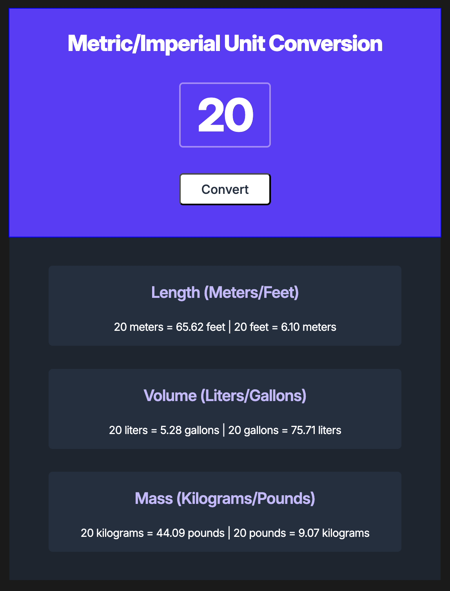

# Unit Converter

A simple, interactive unit conversion web application, made for the Scrimba front-end developer course.
Leverages programatic creation of the unit conversion banners from code & using template literals.

## Features

- Convert between metric and imperial units
- Supports length (meters/feet), volume (liters/gallons), and mass (kilograms/pounds) conversions
- Interactive input field for entering values
- Real-time conversion display
- Clean and responsive user interface

## Technologies Used

- HTML
- CSS
- JavaScript

## How It Works

The application displays a user interface with an input field for entering a numeric value. Users can enter any number, and upon clicking the "Convert" button, the app will display conversions for length, volume, and mass in both metric and imperial units.

## Usage

1. Open `index.html` in a web browser
2. Enter a numeric value in the input field
3. Click the "Convert" button to see the conversions
4. View the converted values for length, volume, and mass

## Files

- `index.html`: The main HTML structure
- `style.css`: Styles for the unit converter
- `script.js`: JavaScript for conversion functionality